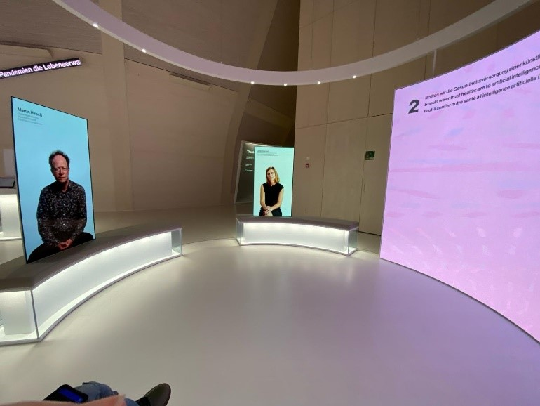
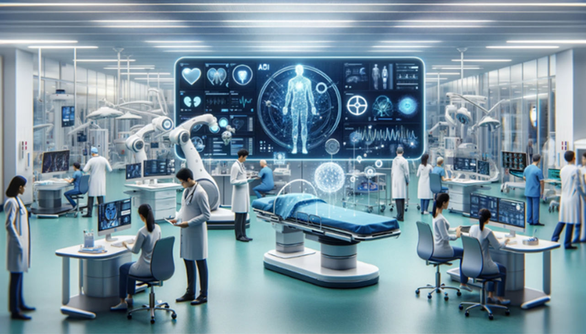

+++
title = "Vom Arzt zum Roboter"
date = "2024-05-08"
draft = false
pinned = true
tags = ["deutsch", "reportage"]
image = "kiindermedizinbildkompressiert.jpg"
footnotes = "\\*Name der Redaktion bekannt"
+++
***Künstliche Intelligenz ist neu für die Welt, vor allem auch für die Welt der Medizin. Wie gehen wir damit um, wie wird KI in der Medizin eingesetzt und welches Potential hat sie? - Diese Reportage zeigt auf, weshalb KI mehr ist, als nur ein Onlineprogramm, das uns einfache Antworten liefert.***

*Von Mia Grossenbacher und Alice Hauri*

Vor dem Interview mit unserem Experten\* sind wir nervös. Doch sobald wir in das IFIK, kurz für Institut für Infektionskrankheiten, eintreten, kommt uns unser aufgeweckter, sympathisch wirkende Interviewpartner\* entgegen. Schnell entwickelt sich ein Gespräch. «Das Problem bei KI ist, dass viele Leute unter KI ChatGPT oder Gemini verstehen», meint er. KI sei jedoch viel mehr als das. In der Forschung verwende man vor allem das sogenannte Machine Learning, ein Teilbereich von KI. Machine Learning fokussiert auf die Fähigkeit eines Computers aus Daten zu lernen, anstelle sie einfach wiederzugeben. Er wird darauf trainiert Muster zu erkennen und somit die Arbeit der Forschenden zu vereinfachen. "Dieses Machine Learning, was wir hier benutzen, ist nur eine Art schneller zu gehen.“, so unser Experte*.  



**Kategorisierung der künstlichen Intelligenz** KI besteht aus den zwei Teilbereichen Machine Learning und Natural Language Processing. Bei Machine Learning handelt es sich um die Fähigkeit von KI, durch die Erkennung von Muster, Vorhersagen oder Entscheidungen zu treffen. Eine Subkategorie von Machine Learning ist das Deep Learning. Dies beschreibt ein neuronales Netz, welches ein menschliches Gehirn simulieren soll und aus Daten lernen kann. Natural Language Processing fokussiert dagegen auf der Interaktion zwischen Computer und Mensch in menschlicher Sprache.



> «Wir trainieren KI mit dem, was wir haben und falls das nicht in der Datenbank liegt, was kann die Software dann sagen?» -Experte*

Wo Menschen nur einzelne Parameter beobachten und vergleichen können, kann KI ganze Systeme analysieren, das wissen wir heute. Die Frage ist demnach nicht, ob KI leistungsfähiger als der Mensch ist, sondern ob wir ihre Benutzung erstreben wollen.  

«Die Vorteile liegen darin, dass wir unsere Mitarbeiterinnen und Mitarbeiter entlasten können, indem bestimmte Aufgaben durch Maschinen ausgeführt werden.», erzählt Roland Wiest, Neurologe am Inselspital Bern, in einem SRF-Beitrag zum Thema. Diese «bestimmten Aufgaben», von denen Wiest spricht, sind grösstenteils repetitive Arbeiten, wie das Analysieren von Bildern oder das Auswerten von Daten. So wird KI im Bereich Diagnostik von grosser Bedeutung sein. Und trotzdem hat KI einen grossen Nachteil: Wenn es falsch programmiert wurde, oder Daten fehlen, macht es Fehler, welche je nachdem gravierend sein könnten. „Wir trainieren KI mit dem, was wir haben und falls das nicht in der Datenbank liegt, was kann die Software dann sagen?“ so auch unser Experte.  

Andrea Hauri (49) meint dazu: «Ich finde, dass Skepsis berechtigt ist oder dass man vorsichtig sein sollte, weil ich überzeugt bin, dass man die Verantwortung beispielsweise in der Medizin für Diagnosestellungen nicht an KI abgeben darf.» Sie ist als Dozentin an der Berner Fachhochschule in ihrem Berufsalltag von KI betroffen. Auch Regina Grossenbacher (70), Rentnerin, hat Angst, dass KI unkontrolliert wird und sich dem Einfluss des Menschen entzieht. Sind diese Bedenken berechtigt?  

**Die Risiken und Konsequenzen von KI** vor allem im Gesundheitswesen, ein Gebiet, in welchem es eigentlich keinen Raum für Fehler hat, muss KI so sicher sein wie möglich. Medizinische Daten sind oft komplex und können Lücken aufweisen. Fehlen der KI beispielsweise wichtige Informationen über einen Patienten, kann dies zu Fehldiagnosen oder falschen Behandlungsempfehlungen führen. KI interpretiert bei falscher oder unvollständiger Programmierung die Daten falsch und macht aufgrund dessen Fehler. KI-Systeme sind demnach stark von der Qualität und Quantität der Daten abhängig. Das Ziel ist, dass KI mithilfe von Machine Learning einen Algorithmus entwickelt, welcher es möglich macht, dass die KI selbst neue Daten erfassen kann. Sprich, KI lernt aus den alten Daten und nutzt diese, um neue Daten zu analysieren. So wird das Risiko von Datenmangel verringert. Ein Problem, welches daraus entstehen könnte, ist der sogenannte Modelldrift: Nach einer gewissen Zeit können KI-Modelle ungenau werden, wenn sich die Daten verändern. In einem Bereich, in dem sich das Wissen ständig weiterentwickelt, ist es besonders wichtig die Modelle regelmässig zu überprüfen und gegebenenfalls sogar neu zu trainieren. Ein weiteres Hindernis, welches bei Deep Learning eintreten könnte, ist die Verstärkung von Verzerrungen in den Daten. Wenn die grundlegenden Daten Vorurteile widerspiegeln, kann KI diese Verzerrungen verstärken. Bei der Diagnose oder Behandlung könnten so bestimmte Bevölkerungsgruppen benachteiligt werden.  

> «Die Entscheidungen trifft immer ein Mensch, das ist wirklich wichtig.» -Experte* 

Manche Leute bangen um ihre Arbeitsplätze, welche von KI ersetzt werden könnten. Diese Befürchtung ist jedoch nur halbwegs berechtigt, denn KI soll bloss als Hilfsmittel verwendet werden, so unser Experte*. «Am Ende, gibt es immer jemanden, der oder die auf einen Verifizierungs-Button klicken muss.», erklärt er. KI erledige also die «uninteressante» Arbeit schneller. «Die Entscheidungen trifft immer ein Mensch, das ist wirklich wichtig.“ KI könnte demnach eine medizinische Zweitmeinung abgeben, so wie ein zweiter Arzt dies bei komplexen Fällen machen könnte. Durch die KI könne man so zu einer sicheren und fundierteren Entscheidung kommen, so Martin Hirsch, Digital Health Experte, im Novartis Pavillon in Basel. Künstliche Intelligenz wird im Gesundheitswesen also keine Stellen ersetzen, aber die Stellenprofile stark verändern.  

Ein weiteres Problem ist der «Blackbox» Effekt. Dieser beschreibt, dass es manchmal schwierig ist nachzuvollziehen, wie KI zu einem bestimmten Ergebnis kommt.  

**Ein Anwendungsbeispiel** In der mikrobiologischen Analytik, welche am IFIK beforscht wird, wird KI in zwei Gebieten angewendet. KI kann Bilder von mikroskopischen Proben analysieren, Bakterien, Pilze und andere Mikroorganismen erkennen. Die Bildanalyse erleichtert den Laborant*innen die Arbeit und verbessert die Genauigkeit. KI besitzt ausserdem die Fähigkeit grosse Datenmengen zu analysieren, um darin Muster zu erkennen. Der Bereich wird Mustererkennung genannt. Unser Experte arbeitet mit einer Nanopore. Dieses Gerät wird zu der Sequenzierung der DNA oder RNA verwendet. Das heisst, dass mit einer Nanopore DNA und RNA schneller als mit herkömmlichen Methoden gelesen werden kann. Ohne KI wäre dies nicht möglich, da es sich um gigantische Datenmengen handelt.  

**Frage der Verantwortung** Eine grosse Frage bezüglich KI ist die Frage der Verantwortung. Wollen Patient*innen ihr Leben in die Hände eines Roboters geben? Andrea Hauri (49) beantwortet diese Frage wie folgt: «Ja, als Unterstützung finde ich das gut, ich möchte aber einfach am Ende einen Arzt, eine Ärztin sehen, die die Verantwortung übernimmt und das, was die KI vorschlägt, als Vorschlag prüft und nochmals kritisch hinterfragt.“ Unser Experte findet auch, dass KI immer überwacht und kontrolliert werden muss. Die Verantwortung trägt am Schluss immer ein Mensch, denn ein Roboter kann keine Verantwortung tragen. 

**Blick in die Zukunft** Künstliche Intelligenz ist die Schlüsseltechnologie der Zukunft. Momentan wird KI in der Medizin benutzt, um Daten auszuwerten, Bilder zu analysieren und Diagnosen zu erstellen. Vor allem in der Mikrobiologie wird KI eingesetzt, so auch am Institut für Infektiologie Bern. Eine grosse Hoffnung ist laut unserem Experten ganz klar ein Frühwarnsystem vor Epidemien wie z.B. Covid. «In Zukunft könnte KI mit genügend Daten vielleicht ein Frühwarnsystem für Krankheiten und Epidemien entwickeln.» Doch auch wenn KI in unserem Alltag schon sehr präsent ist, sind wir von diesem Schritt aufgrund fehlender Daten noch weit entfernt.  

In Kliniken, Krankenhäusern und Arztpraxen werden hoffentlich bald Datenmanagementsysteme, KI-gestützte Auswertungen, Roboterassistenten im OP, intelligente Assistenten und viele weitere KI gestützte Technologien verwendet werden. Gerade im Bereich Gesundheit und Medizin ist KI schon fast essenziell für den Fortschritt. KI ist schneller und genauer als die Menschen, Maschinen werden nicht müde. Doch ist das Vertrauen in KI auf Seiten Ärzten und Patienten genug gross für eine solche Entwicklung?  

**Kosten- und Umweltbelastung** KI könnte in einem Zeitalter von explodierenden Gesundheitskosten die rettende Hand sein. Allein in Europa werden laut einer Studie von PwC in den kommenden zehn Jahren die Gesundheitsausgaben um einen dreistelligen Milliardenbetrag gesenkt werden können – dank KI. In einer Studie zum Thema, die auf Jawa Network Open veröffentlicht wurde, wird diese Erkenntnis hinterfragt. Die Studie untersuchte die Kosteneffizienz von KI-Entscheidungsunterstützungssystem in der Dermatologie, Zahnmedizin und Augenheilkunde. Sie kamen zum Schluss, dass selbst wenn KI eine bessere Diagnosekapazität als der durchschnittliche Arzt hat, dies möglicherweise nicht direkt zu einer besseren oder kostengünstigeren Versorgung führt. Die Kosteneffizienz sei jedoch stark von der für den Einsatz der KI verwendete Gebühr abhängig.  

Über die Umweltbelastung von KI wird kaum gesprochen. "Die gesamte Infrastruktur der Rechenzentren und die Netzwerke zur Datenübermittlung sind weltweit für zwei bis vier Prozent der weltweiten CO2-Emissionen verantwortlich", sagt Anne Mollen, Forscherin bei der Organisation Algorithmwatch, in einem Bericht von DW. KI sei ein grosser Teil davon. Eine Studie von Forschern der University of Massachusetts, Amherst, belegt, dass ein gewöhnlich grosser KI-Algorithmus 284.000 Kilogramm CO2-Äquivalent ausstoßen kann. Die Studie bezieht sich wahrscheinlich auf ein besonders energieintensives KI-Modell – trotzdem, das ist eine gigantische Menge. Ein Auto inklusive Herstellung stösst im Vergleich ein Fünftel der Emissionen aus. 

> «Der Mensch denkt immer er kann alles besser als die Maschine, aber die Maschine hat schon alles analysiert.» -Experte* 

**Was ist die sinnvolle Entwicklung?** KI ist lange nicht perfekt. Die Risiken bei falschem Programmieren sind in allen Gebieten gross. In der Medizin braucht es jedoch eine spezielle Vorsicht. Ist die KI schon bereit für eine solche Genauigkeit? Oder wichtiger, ist der Mensch bereit KI richtig zu programmieren und richtig damit umzugehen? KI existiert schon fast überall in unserem Alltag. Nicht nur in Chat GPT, sondern in Handys, Autos, Flugzeugen und seit nicht sehr lange auch in der Medizin. Wie weit ist KI schon in unser Leben eingedrungen? „Es liegt an unserer Generation zu sagen, wieviel man der Maschine überlassen kann.“, sagt unser Experte. Gibt es überhaupt noch ein Zurück? KI sei der Meinung von unserem Experten nach, ein Teil des natürlichen Evolutionsprozess des Menschen. Auch Regina Grossenbacher (70) findet, dass man die Augen nicht vor etwas verschliessen könne, was schon lange Realität sei.  

KI hat trotz der Risiken ein gigantisches Potential. Wie weit könnte die Medizin und damit die Menschheit mit KI kommen? «Der Mensch denkt immer er kann alles besser als die Maschine, aber die Maschine hat schon alles analysiert.», findet unser Experte.